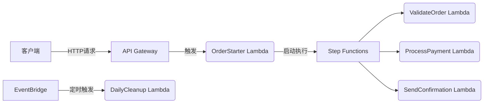

以下是一个使用Java和AWS服务的完整Demo实现，涵盖API Gateway、Lambda、Step Functions和EventBridge。这个示例模拟了一个订单处理流程：

### 1. 项目结构
```
order-processing-demo/
├── pom.xml
├── src/
│   └── main/
│       ├── java/
│       │   └── com/
│       │       └── example/
│       │           ├── OrderStarter.java         # API Gateway触发的Lambda
│       │           ├── ValidateOrder.java        # Step Function任务1
│       │           ├── ProcessPayment.java       # Step Function任务2
│       │           ├── SendConfirmation.java     # Step Function任务3
│       │           └── DailyCleanup.java         # EventBridge触发的Lambda
│       └── resources/
│           └── statemachine.asl.json            # Step Function定义
```

### 2. Maven依赖 (pom.xml)
```xml
<project>
    <modelVersion>4.0.0</modelVersion>
    <groupId>com.example</groupId>
    <artifactId>order-processing-demo</artifactId>
    <version>1.0-SNAPSHOT</version>
    
    <properties>
        <maven.compiler.source>11</maven.compiler.source>
        <maven.compiler.target>11</maven.compiler.target>
        <aws.sdk.version>2.20.26</aws.sdk.version>
    </properties>
    
    <dependencies>
        <!-- AWS Lambda -->
        <dependency>
            <groupId>com.amazonaws</groupId>
            <artifactId>aws-lambda-java-core</artifactId>
            <version>1.2.2</version>
        </dependency>
        <dependency>
            <groupId>com.amazonaws</groupId>
            <artifactId>aws-lambda-java-events</artifactId>
            <version>3.11.1</version>
        </dependency>
        
        <!-- AWS SDK v2 -->
        <dependency>
            <groupId>software.amazon.awssdk</groupId>
            <artifactId>sfn</artifactId>
            <version>${aws.sdk.version}</version>
        </dependency>
        <dependency>
            <groupId>software.amazon.awssdk</groupId>
            <artifactId>lambda</artifactId>
            <version>${aws.sdk.version}</version>
        </dependency>
        
        <!-- JSON处理 -->
        <dependency>
            <groupId>com.fasterxml.jackson.core</groupId>
            <artifactId>jackson-databind</artifactId>
            <version>2.13.4</version>
        </dependency>
    </dependencies>
    
    <build>
        <plugins>
            <plugin>
                <groupId>org.apache.maven.plugins</groupId>
                <artifactId>maven-shade-plugin</artifactId>
                <version>3.2.4</version>
                <configuration>
                    <createDependencyReducedPom>false</createDependencyReducedPom>
                </configuration>
                <executions>
                    <execution>
                        <phase>package</phase>
                        <goals>
                            <goal>shade</goal>
                        </goals>
                    </execution>
                </executions>
            </plugin>
        </plugins>
    </build>
</project>
```

### 3. Java 实现

#### 3.1 OrderStarter.java (API Gateway → Lambda)
```java
package com.example;

import com.amazonaws.services.lambda.runtime.Context;
import com.amazonaws.services.lambda.runtime.RequestHandler;
import com.amazonaws.services.lambda.runtime.events.APIGatewayProxyRequestEvent;
import com.amazonaws.services.lambda.runtime.events.APIGatewayProxyResponseEvent;
import software.amazon.awssdk.services.sfn.SfnClient;
import software.amazon.awssdk.services.sfn.model.StartExecutionRequest;

import java.util.Map;

public class OrderStarter implements RequestHandler<APIGatewayProxyRequestEvent, APIGatewayProxyResponseEvent> {

    @Override
    public APIGatewayProxyResponseEvent handleRequest(APIGatewayProxyRequestEvent input, Context context) {
        try {
            // 从环境变量获取状态机ARN
            String stateMachineArn = System.getenv("STATE_MACHINE_ARN");
            
            // 解析请求参数
            Map<String, String> queryParams = input.getQueryStringParameters();
            String orderId = queryParams.get("orderId");
            String amount = queryParams.get("amount");
            
            // 构建Step Function输入
            String executionInput = String.format(
                "{\"orderId\": \"%s\", \"amount\": %s}", 
                orderId, amount
            );
            
            // 启动状态机执行
            try (SfnClient sfnClient = SfnClient.create()) {
                String executionArn = sfnClient.startExecution(StartExecutionRequest.builder()
                        .stateMachineArn(stateMachineArn)
                        .input(executionInput)
                        .build())
                        .executionArn();
                
                return new APIGatewayProxyResponseEvent()
                        .withStatusCode(200)
                        .withBody("{\"message\": \"Order processing started\", \"executionArn\": \"" + executionArn + "\"}");
            }
        } catch (Exception e) {
            return new APIGatewayProxyResponseEvent()
                    .withStatusCode(500)
                    .withBody("{\"error\": \"" + e.getMessage() + "\"}");
        }
    }
}
```

#### 3.2 ValidateOrder.java (Step Function任务1)
```java
package com.example;

import com.amazonaws.services.lambda.runtime.Context;
import com.amazonaws.services.lambda.runtime.RequestHandler;
import com.fasterxml.jackson.databind.JsonNode;
import com.fasterxml.jackson.databind.ObjectMapper;

public class ValidateOrder implements RequestHandler<Object, Object> {
    
    private static final ObjectMapper mapper = new ObjectMapper();

    @Override
    public Object handleRequest(Object input, Context context) {
        try {
            JsonNode inputNode = mapper.valueToTree(input);
            String orderId = inputNode.get("orderId").asText();
            double amount = inputNode.get("amount").asDouble();
            
            // 验证逻辑
            if (amount <= 0) {
                throw new IllegalArgumentException("Invalid order amount");
            }
            
            // 添加验证结果
            return mapper.createObjectNode()
                    .put("orderId", orderId)
                    .put("amount", amount)
                    .put("status", "VALIDATED")
                    .put("validationMessage", "Order validated successfully");
        } catch (Exception e) {
            throw new RuntimeException("Validation failed: " + e.getMessage());
        }
    }
}
```

#### 3.3 ProcessPayment.java (Step Function任务2)
```java
package com.example;

import com.amazonaws.services.lambda.runtime.Context;
import com.amazonaws.services.lambda.runtime.RequestHandler;
import com.fasterxml.jackson.databind.JsonNode;
import com.fasterxml.jackson.databind.ObjectMapper;
import com.fasterxml.jackson.databind.node.ObjectNode;

public class ProcessPayment implements RequestHandler<Object, Object> {
    
    private static final ObjectMapper mapper = new ObjectMapper();

    @Override
    public Object handleRequest(Object input, Context context) {
        JsonNode inputNode = mapper.valueToTree(input);
        String orderId = inputNode.get("orderId").asText();
        double amount = inputNode.get("amount").asDouble();
        
        // 模拟支付处理
        String paymentId = "PAY-" + System.currentTimeMillis();
        String paymentStatus = "SUCCESS";
        
        // 构建输出
        ObjectNode output = mapper.createObjectNode();
        output.put("orderId", orderId);
        output.put("amount", amount);
        output.put("status", "PAYMENT_PROCESSED");
        output.put("paymentId", paymentId);
        output.put("paymentStatus", paymentStatus);
        
        return output;
    }
}
```

#### 3.4 SendConfirmation.java (Step Function任务3)
```java
package com.example;

import com.amazonaws.services.lambda.runtime.Context;
import com.amazonaws.services.lambda.runtime.RequestHandler;
import com.fasterxml.jackson.databind.JsonNode;
import com.fasterxml.jackson.databind.ObjectMapper;
import com.fasterxml.jackson.databind.node.ObjectNode;

public class SendConfirmation implements RequestHandler<Object, Object> {

    @Override
    public Object handleRequest(Object input, Context context) {
        JsonNode inputNode = new ObjectMapper().valueToTree(input);
        String orderId = inputNode.get("orderId").asText();
        String paymentId = inputNode.get("paymentId").asText();
        
        // 模拟发送确认
        String confirmationId = "CONF-" + System.currentTimeMillis();
        
        // 最终输出
        ObjectNode output = (ObjectNode) inputNode;
        output.put("status", "COMPLETED");
        output.put("confirmationId", confirmationId);
        output.put("message", "Order processed successfully");
        
        return output;
    }
}
```

#### 3.5 DailyCleanup.java (EventBridge → Lambda)
```java
package com.example;

import com.amazonaws.services.lambda.runtime.Context;
import com.amazonaws.services.lambda.runtime.RequestHandler;
import com.amazonaws.services.lambda.runtime.events.ScheduledEvent;

public class DailyCleanup implements RequestHandler<ScheduledEvent, String> {

    @Override
    public String handleRequest(ScheduledEvent event, Context context) {
        String time = event.getTime();
        context.getLogger().log("Daily cleanup triggered at: " + time);
        
        // 模拟清理任务
        int deletedRecords = (int) (Math.random() * 1000);
        context.getLogger().log("Cleaned up " + deletedRecords + " expired records");
        
        return "Cleanup completed at " + time;
    }
}
```

### 4. Step Function定义 (statemachine.asl.json)
```json
{
  "Comment": "订单处理流程",
  "StartAt": "ValidateOrder",
  "States": {
    "ValidateOrder": {
      "Type": "Task",
      "Resource": "arn:aws:lambda:us-east-1:123456789012:function:ValidateOrderFunction",
      "Next": "ProcessPayment"
    },
    "ProcessPayment": {
      "Type": "Task",
      "Resource": "arn:aws:lambda:us-east-1:123456789012:function:ProcessPaymentFunction",
      "Next": "SendConfirmation"
    },
    "SendConfirmation": {
      "Type": "Task",
      "Resource": "arn:aws:lambda:us-east-1:123456789012:function:SendConfirmationFunction",
      "End": true
    }
  }
}
```

### 5. 部署步骤

#### 5.1 构建项目
```bash
mvn clean package shade:shade
```

#### 5.2 创建Lambda函数
1. 上传JAR包到5个Lambda函数：
   - OrderStarter
   - ValidateOrder
   - ProcessPayment
   - SendConfirmation
   - DailyCleanup

2. 配置环境变量：
   - OrderStarter: `STATE_MACHINE_ARN = <你的状态机ARN>`

#### 5.3 创建Step Functions状态机
1. 使用提供的statemachine.asl.json
2. 关联对应的Lambda ARN

#### 5.4 配置API Gateway
1. 创建REST API
2. 添加GET方法：`/orders`
3. 集成到OrderStarter Lambda
4. 部署API

#### 5.5 配置EventBridge规则
1. 创建规则：`daily-cleanup`
2. 计划表达式：`cron(0 12 * * ? *)` (每天UTC时间12:00)
3. 目标：DailyCleanup Lambda

### 6. 权限配置 (IAM策略)
```json
{
  "Version": "2012-10-17",
  "Statement": [
    {
      "Effect": "Allow",
      "Action": [
        "lambda:InvokeFunction",
        "states:StartExecution"
      ],
      "Resource": "*"
    },
    {
      "Effect": "Allow",
      "Action": "logs:CreateLogGroup",
      "Resource": "arn:aws:logs:*:*:*"
    },
    {
      "Effect": "Allow",
      "Action": [
        "logs:CreateLogStream",
        "logs:PutLogEvents"
      ],
      "Resource": [
        "arn:aws:logs:*:*:log-group:/aws/lambda/*"
      ]
    }
  ]
}
```

### 7. 测试流程

#### 7.1 通过API Gateway触发
```bash
curl "https://<your-api-id>.execute-api.us-east-1.amazonaws.com/prod/orders?orderId=ORD-12345&amount=99.99"
```

响应示例:
```json
{
  "message": "Order processing started",
  "executionArn": "arn:aws:states:us-east-1:123456789012:execution:OrderProcessingStateMachine:abc123"
}
```

#### 7.2 Step Functions执行流程
1. ValidateOrder: 验证订单有效性
2. ProcessPayment: 模拟支付处理
3. SendConfirmation: 发送确认信息

#### 7.3 EventBridge定时触发
每天UTC时间12:00自动触发DailyCleanup Lambda

### 8. 架构图解


### 9. 本地测试建议

1. 使用AWS SAM CLI测试Lambda：
```yaml
# template.yaml
Resources:
  OrderStarter:
    Type: AWS::Serverless::Function
    Properties:
      CodeUri: target/order-processing-demo-1.0-SNAPSHOT.jar
      Handler: com.example.OrderStarter::handleRequest
      Environment:
        Variables:
          STATE_MACHINE_ARN: "arn:aws:states:us-east-1:123456789012:stateMachine:MyStateMachine"
```

2. 测试EventBridge触发器：
```java
public class TestDailyCleanup {
    public static void main(String[] args) {
        ScheduledEvent event = new ScheduledEvent();
        event.setTime(new Date().toString());
        
        String result = new DailyCleanup().handleRequest(event, null);
        System.out.println(result);
    }
}
```

### 最佳实践
1. **环境变量管理**：使用AWS Systems Manager Parameter Store存储敏感数据
2. **错误处理**：在Step Function中添加Catch配置
3. **日志记录**：使用Lambda Powertools简化日志记录
4. **X-Ray集成**：启用AWS X-Ray进行请求追踪
5. **版本控制**：使用Lambda版本和别名管理部署

这个Demo展示了AWS核心服务的无缝集成，您可以根据业务需求扩展：
- 添加SNS发送通知
- 使用DynamoDB存储订单状态
- 集成S3存储订单附件
- 添加人工审批步骤
